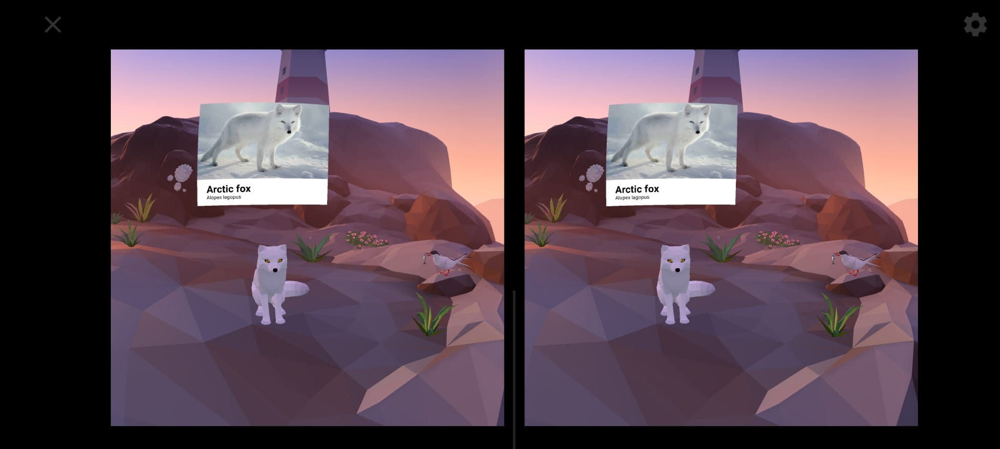
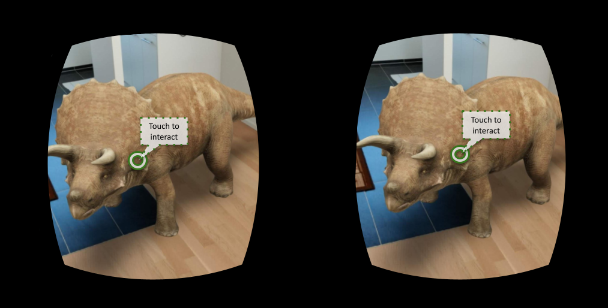
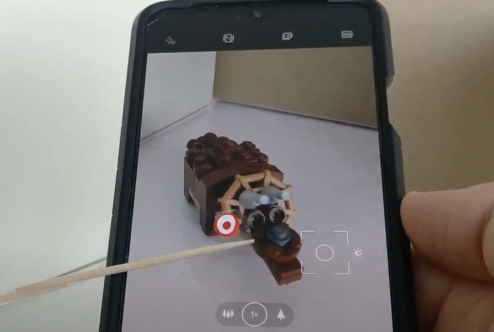
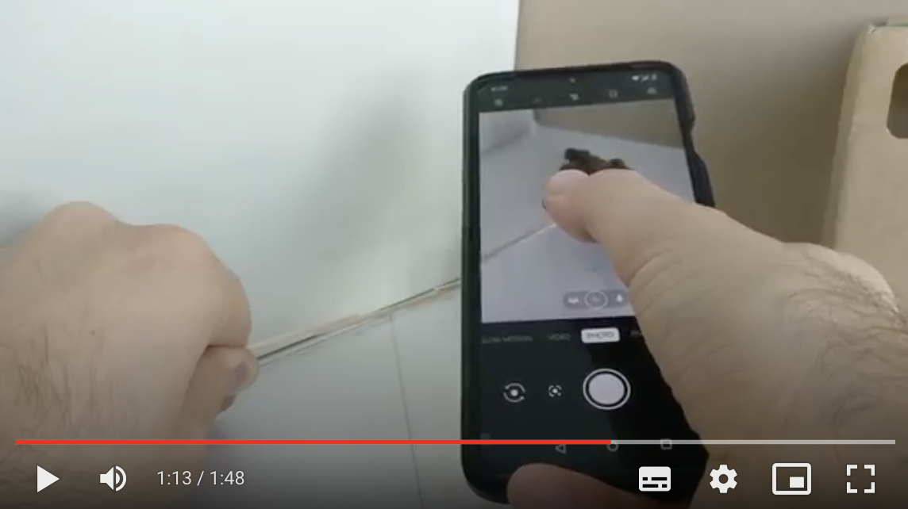

# Part 2: UX & Interaction Design for XR #

Second part of the Extended Reality Specialization course by Michael Nebeling from University of Michigan.

Official link on Coursera: [User Experience & Interaction Design for AR/VR/MR/XR](https://www.coursera.org/learn/user-experience-interaction-design-augmented-virtual-mixed-extended-reality)

## Abstract ##

This second course in the XR for Everybody specialization looks at how to design new user experiences for XR
technologies. The course provides learners with a design thinking mindset and equips them with a fundamental toolbox for
creating XR applications using rapid prototyping. It starts with a broad overview of the complete XR design process,
discussing different paths to becoming an XR creator, what is generally involved in making XR experiences, and how to
best get started. The course then emphasizes design thinking, critiques, and ethics while introducing guidelines and
user-centered techniques like design jams. The second half of the course introduces a variety of methods and tools for
prototyping both physically and digitally including on the XR devices themselves through immersive authoring.

The course has an honors track that guides learners through creating their own storyboard, physical prototype, and
digital prototype of an XR experience. You will work on exercises that allow you to practice your design skills and also
build XR technologies into your workflow by working with specific templates and new digital tools that allow you to
preview physical prototypes on AR/VR devices.

## Notes ##

...

## Assignments ##

## Assignment 1 - Your XR design critique ##

I played around with the 3D models of dinosaurs that Google propose when you search a some kind of dinosaur from your
mobile device. This project is done in partnership with Jurassic World, and only the specimens from the franchise are
available.

**I Like**

- the realism of the dinosaur, with many details and realistic movements;
- the "_view actual size_" feature.

**I Wish**

- a better understanding of the space, since most of the times the app is not able to place the dinosaur correctly in
  the space, even in very simple cases (see attached screenshots [1](./assignments-materials/triceratops_1.jpg), 
  [2](./assignments-materials/triceratops_2.jpg), and [3](./assignments-materials/triceratops_3.jpg));
- allow the "_view actual size_" feature only if there is enough space! ...it doesn't make sense that I see a non-sense
  placement in an indoor space (see [attached screenshot](./assignments-materials/triceratops_0.jpg));
- more dinosaurs!

**What If**

- dinosaurs could do simple interaction (e.g. emit a sound when touched);
- the space detection could be selected interactively together with the user.

My expectation have been met for the purpose of the app, even if I'm looking forward for additional feature that could
be easy to add, for example a basic interaction with the dinosaur.

## Assignment 2 - Storyboard ##

With my prototype, I'd like to improve the experience of the 3D models of dinosaurs that Google propose when you search
a some kind of dinosaur from mobile. As discussed in the previous assignment, I like the realism of the dinosaur, but
I'd like to have:

1. a better understanding of the space; for example, at the beginning of the process, the space detection can be
   selected interactively together with the user;
2. allow the interaction with the dinosaur (e.g. emit a sound when touched);
3. provide additional info about the dinosaur (in place of the "_view actual size_" problematic feature).

About point 3, I got inspiration from the "Arctic Journey" demo in the Google Cardboard default app (see the image
attached below).

The [attached sketch](./assignments-materials/Sketch.jpg) describes the additional features 1, 2 and 3, with a simple
description of each step. I also created a sample result using a [mock of the cardboard frame](./design-materials/stereo_view.png).

## Assignment 3 - Physical prototype ##

For this assignment I created a physical prototype of the enhanced experience I designed for the dinosaurs 3D models
provided by Google in collaboration with Jurassic World. I took advantage of the previous storyboard, narrowing the
focus mainly on the following two aspects:

- interact with the dinosaur;
- get additional info about the dinosaur.

With this experiment I was able to get a better understanding of the usability, identifying more details about the
environment and the interactions.

For the diorama I used Lego instead of clay, obtaining a pretty fair result (I'm very proud of my triceratops :)

The physical prototype includes:

- A [paper sketch](./assignments-materials/Sketch.jpg) of the prototype with expected interactions
- The 3D model of the triceratops built with Lego
- The interactive prompts the app should show the user during the interaction: the blinking red dot to indicate the
  place where user will click and the popup message in a label with the info about the current dinosaur.

## Assignment 4 - Digital prototype ##

I realized a digital prototype with pictures and then with a demo video. 
In the video I tried to describe the expected result with a 360 3D-experience. The main idea is to prototype first
physically and then digitally. I also tried to experiment with [XR MOOC](https://xrmooc.glitch.me/camera/vr) but the
result was not good, and I preferred to submit the experience I got with a regular mobile camera.

